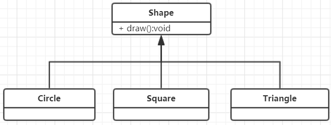
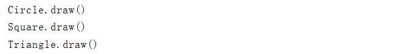

## RRTI 系列 (1)
> 最近在阅读 <Java Thinking >，RRTI来源于第十四章；以前自认为了解RTTI，只想简简单单巩固一下，读完之后，信息量实在太大，只好多花点篇幅来记载了~   

####  RRTI 是什么
> RRTI(Run-Time Type Information)：运行时类型信息

#### RRTI 能做什么
<font color=red>**运行时类型信息使得你可以在程序运行时发现和使用类型信息.**</font>
它是你能从只能在编译期执行面向类型的操作的禁锢中解脱了出来，并且可以使用某些非常强大的程序.
Java中运行时识别对象和类信息的两种方式：

-  "传统"的RTTI，它假定我们在编译时已经知道了所有的类型 (即强制类型转换 (dog)Animal)
-  "反射"机制，它允许我们在运行时动态的发现和使用类的信息

### 为什么需要RRTI
首先还是从一个简单的案例入手吧 ^-^，Shape作为基类，派生类为Circle、Square、Triangle,使用了多态的类层次结构,类图如下：

这是一个典型的类层次，基类位于顶部，派生类向下扩展。面向对象编程中的基本目的是：让代码只操作对基类(这里是Shape)的引用。这样，如果要增加一个新类(比如从Shape派生的Rhomboid)来扩展程序将不会影响到原来的代码.
Shape接口中动态绑定了draw()方法，目的就是让客户端程序员使用泛化的Shape来引用draw()。draw()在所有派生类里都会被覆盖(继承)，并且由于它是被动态绑定的，所有即使通过泛化的Shape引用来调用也能产生正确的行为。这就是多态.
因此，通常会创建一个具体的对象(Circle、Square或Triangle)，将它向上转型为Shape(忽略具体对象的类型)，并在后面的程序使用匿名(既不知道具体类型)的Shape引用。

```
public abstract class Shape {
    void draw() {System.out.println(this + ".draw()");}

    /**
     * toString被声明为abstract，以此来强制继承者重写该方法3
     */
    @Override
    abstract public String toString();
}

class Circle extends Shape{
    @Override
    public String toString() {return "Circle";}
}

class Square extends Shape{
    @Override
    public String toString() {return "Square";}
}

class Triangle extends Shape{
    @Override
    public String toString() {return "Triangle";}
}

public class Shapes {
    public static void main(String[] args){
        List<Shape> shapes = Arrays.asList(new Circle(), new Square(), new Triangle());
        for (Shape shape : shapes) {
            shape.draw();
        }
    }
}
```

输出结果：

输出结果很简单，代码看似简单其实不简单。在这个例子中，当把`Shape`对象放入`List<Shape>`集合时会向上转型，但在向上转型为Shape时也丢失Shape对象的具体类型，对于集合而言，它们只是Shape类的对象。
当从集合中取出元素时，这种容器---实际上它将所有的事物都当做Object持有---会自动将结果转型回Shape，这是RTTI最基*本的使用形式，因为在Java中，所有类型转换都是在运行时进行正确性检查的。**这就是RTTI名字的含义：在运行时，识别一个对象的类型**

在这个例子中，RTTI类型转换并不彻底，Object被转型为Shape，而不是转型为Circle、Square或Triangle。这是 因为目前我们只知道`List<Shape>`保存的都是`Shape`。在编译时将由容器和Java的泛型系统来强制确保这一点，而在运行时由类型转换操作来确保这一点.

接下来就是多态机制的事情了，Shape对象实际执行什么样的代码，是由引用所指向的具体对象Circle、Square或Triangle而决定的，通常，也正是这样要求的，你希望大部分代码尽可能少地了解对象的具体类型，而是只与对象家族中的一个通用表示打交道(在这个例子中是Shape)。这样代码会更容易写，更容易读，且更便于维护；设计也更容易实现、理解和改变，所以"多态"是面向对象编程的基本目标。

