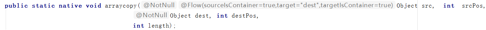

### 数组结构真的懂了吗？

> 新手学习，记录一下 ，便于以后复习 ^-^

> 数组是一种基本的数据结构，用于按顺序存储元素的集合。但是元素可以随机存取，因为数组中的每个元素都可以通过索引来访问。数组可以有一个或多个维度，这里仅仅介绍一维数组，也被称为线性数组。

如下定义了一个A数组：


数组A中存储了5个元素，也就是说数组的长度为5，**需要注意的是数组的索引从0开始**，因此我们可以使用A[0]表示第一个元素，即A[0]=1,A[1]=2,依次类推.

#### 如何定义数组

```java
// 第一种，动态初始化：此时只是定义了数组的长度，并未赋值 
int[] arr = new int[5];
// 第二种 ，静态初始化：指定了数组元素的初始值，虚拟机将会自动分配5个长度 
int[] arr=new int[]{1,2,3,4,5};
// 第三种，第二种的简化版
int[] arr = {1,2,3,4,5};
```

#### 数组结构的特征

- 定义数组以后长度就已经固定
- 数组在内存中为一块连续的空间
- 可以直接通过索引进行访问
- 只能存储同一种类型的元素
- 查询效率快，增删慢

#### 获取元素

根据index可以直接获取元素，效率非常高，如获取index为1的元素

```java
int[] arr = {1,2,3,4,5};
int result=arr[1];
```


#### 添加元素

当定义完数组后，数组长度已经固定，如下数组长度为5，当你访问第六个元素时将抛出异常，并且只能存储同一种类型的元素，如下arr数组只能存储int类型的元素，如果初始化时没有赋值，可以通过index去给数组赋值

```java
int[5] arr = new int[5];
for(int i = 0,length = arr.length;i<length;i++){
    arr[i] = i+1;
    System.out.println(arr[i]);
}

//arr[0] = "a"; 不能通过编译
//抛出 ArrayIndexOutOfBoundsException 异常
//arr[5] = 6 ;index从0开始，arr[5]即访问第六个元素

//=============
output:1,2,3,4,5
```

#### 修改元素

通过index获取到元素并重新赋值即可,如下将index=2的位置上的元素修改为0

```java
int[] arr = {1,2,3,4,5};
arr[2] = 0; 
```

#### 删除元素

删除元素比较麻烦，如删除index=2位置上的元素，需要将index=2后面的所有元素向前移动一位并覆盖，再将数组最后一个元素置为空，效率较低，如下图 ：	


```java
int delIndex = 2;
Integer[] arr = {1,2,3,4,5};
int length = arr.length;
int copyIndex = delIndex+1; //开始移动的位置
for(int i = copyIndex;i<length;i++){
   arr[delIndex++] = arr[i]; //移动覆盖
}
arr[length-1] = null;//最后一个置为空
```

#### 动态数组

上面我们提到，数组在定义以后长度就固定了，只能存储固定个数的元素，这让我们使用起来可能不方便，而且有可能造成空间的浪费，在实际使用中，我们可能事先并不知道要存储多少元素，**希望当数组中容量不够时能够自动扩容**，这时我们动态数组就出现了,它是一个大小可变的数组.

Collection Framework的`ArrayList`就是一个动态数组，那该如何实现一个动态数组呢 ？

#### 实现动态数组

思路：因为数组在定义以后长度就固定了，想要对数组扩容就必须创建一个拥有更大容量的新的数组，将原来数组的数据Copy到新数组中，然后将新数组返回给调用者，从而实现动态数组的功能.


如上图，我们定义了一个容量为5的`oldArray`数组，当向`oldArray`添加第6个元素时，`oldArray`容量不足，这时我们定义了一个容量为10的`newArray`数组，先将`oldArray`数组的数据Copy到`newArray`数组，然后将新数组返回给调用者，这时数组容量已经变为了10，此时再将元素6存储数组即可，这样每当数组容量不够时，就进行扩容，这样就能实现数组大小的不断变化，从而实现动态数组的功能.

```java
Integer[] arr ={1,2,3,4,5};
arr = dynamicArray(arr, 10);
arr[5] = 6;
Stream.of(arr).forEach(System.out::println);
//output：1,2,3,4,5,6,null,null,null,null

public Integer[] dynamicArray(Integer[] sourceArr,int newLength){
  Integer[] newArr = new Integer[newLength];
  for(int i = 0 ,length = sourceArr.length;i<length;i++){
      newArr[i] = sourceArr[i];
  }
  return newArr;
}
```


从上述例子可以发现，每次扩容都需要定义一个新数组，然后将原来数组数据Copy至新数组，这是一个非常耗时的过程，所以在选择新数组每次扩容大小的时候，应该根据实际业务进行考虑，避免扩容次数过于频繁.

#### Java API

- `Arrays.copyOf(T[] original, int newLength)`

该方法能够实现上述动态数组的功能，且使用了泛型，更加灵活，它有两个参数：

- `original` 表示原数组，
- `newLength` 表示新数组的长度

```java
Integer[] arr = {1,2,3,4,5};
arr = Arrays.copyOf(arr,10);//该方法也能实现将arr容量扩大为10
arr[5]=6;
Stream.of(arr).forEach(System.out::println);
//output：1,2,3,4,5,6,null,null,null,null
```


- ` System.arraycopy(Object src,int srcPos,Object dest,int destPos,int length);`

`Arrays.copyOf(T[] original, int newLength)`就是调用该方法实现的，该方法由`native`关键字修饰，表明是由C/C++实现的，它不仅仅能够实现扩容的功能，还能实现删除；它有四个参数：

- `src ` 表示原数组
- `srcPos` 表示原数组开始复制的位置
- `dest` 表示目标数组
- `destPos` 表示源数组数据在目标数组插入的位置
- `length` 表示源数组数据拷贝的长度



使用`System.arraycopy()`进行扩容，`src`为原数组，`dest`为新数组，将`dest` 返回给调用者，达到扩容的目的.

```java
String[] src = {"A","B","C","D","E"};
//定义的新数组
String[] dest = new String[10];
/*会将src的数据从index=0开始，复制src.length个，也就是复制全部，
  插入到dest数组中，从index=0位置开始插入*/
System.arraycopy(src,0,dest,0,src.length);
Stream.of(dest).forEach(System.out::println)
//output："A","B","C","D","E",null,null,null,null,null
```

使用`System.arraycopy()` 进行删除，删除index=2的元素即C，思路还是通过移动覆盖.，拷贝C后面的元素D、E，将其向前移动一位，再将最后一位置为空.

```java
String[] src = {"A","B","C","D","E"};
int delIndex = 2; //删除元素的index
int srcPoc = delIndex+1; //需要移动元素的开始位置，为删除元素的后一个即从D开始移动
int destPos = delIndex; // 目标数组开始插入的位置,覆盖删除元素
int moveNum = src.length - delIndex - 1; //需要移动的个数 ，即D,E
System.arraycopy(src,srcPoc,src,destPos,moveNum);
src[src.length-1] = null;//最后一个元素置为空
Stream.of(arr).forEach(System.out::println);
//output:A、B、D、E、null
```

使用`System.arraycopy()`还能做更多有趣的事情，就不一 一举例了~

#### 总结

- 数组数据结构查询通过索引直接访问元素，效率较高

- 数组数据结构动态扩容时需定义一个新数组，然后将原来数组数据Copy至新数组，效率较低

- 数组数据结构删除元素，需要通过移动覆盖，效率较低

  