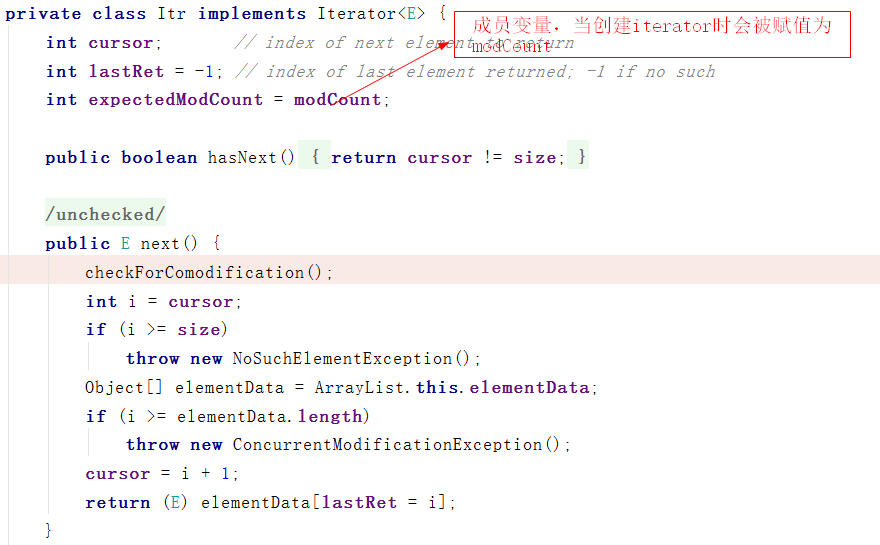

### ArrayList 源码分析


> ArrayList属于Collection Framework中的一员，底层使用数组数据结构，实现了List接口，能够存储任何元素包括null值，存储顺序有序,该类大致与Vector一样，除了它是线程不安全.

#### 类图如下


ArrayList底层就是使用一个Object类型的数组存放的，从而可以容纳任何类型，ArrayList其实就是Java中的动态数组.

对数组结构还不了解的童鞋可以看一下前面写的：[数组结构真的懂了吗？]( https://zhuanlan.zhihu.com/p/101173033)


每一个ArrayList都有一个容量(capacity)，即当前底层数组的长度，容器内存放的元素不能大于当前的容量，当向容器添加元素时，如果容量不足，容器会通过**扩容机制**对底层数组进行扩容,从而实现**动态增长**.

这里有个问题：

- ArrayList的扩容机制是什么 ?

让我们记住这个问题，去源码中找答案吧~~

#### 源码分析

首先，看一下ArrayList的属性：


`ArrayList `中还有一个比较重要的属性`modCount`，继承至`AbstractList`：


我们又多了一个问题：

- fail-fast机制是啥？

#### 构造函数


#### add方法


通过`ensureExplicitCapacity`做剩余空间检查，如果当前所需的最小容量大于数组的长度，此时调用`grow()`方法进行扩容.


分析完`add()`方法后，就能解决我们的第一个问题：

- ArrayList底层扩容机制

  ArrayList每次扩容后的容量为原来数组的1.5倍，通过数组拷贝的方式实现动态扩容，每次扩容都需要通过数组拷贝的方式进行扩容，效率较低.

#### get方法

`get`方法非常简单，首先检查索引是否越界，然后根据索引从数组中取出元素，效率非常快，时间复杂度为O(1).


#### Set方法

首先检查索引是否越界，然后根据索引获取到原来的值并设置新的值，最后返回原来的值.


#### remove方法

删除元素还是通过移动覆盖的思路实现的.


#### fail-fast

第一次接触这个名词时慌得一批，赶紧去百度了一波 ,百度百科解释如下：

>**fail-fast 机制是java集合(Collection)中的一种错误机制。**当多个线程对同一个集合的内容进行操作时，就可能会产生fail-fast事件。例如：当某一个线程A通过iterator去遍历某集合的过程中，若该集合的内容被其他线程所改变了；那么线程A访问集合时，就会抛ConcurrentModificationException异常，产生fail-fast事件.

其实fail-fast是一种理念，一种在设计程序时预先考虑可能发生的异常情况，一旦发生异常情况后，立马终止程序并上报错误，而不是在未来冒着不确定的风险.

在我们的日常编程其实经常接触到fail-fast，如用户信息的空验证：

```java
public User validateUser(User user){
    if(user==null){
        throw new RuntimeException("用户信息不能为空!");
    }
	return user;
}
```

这其实就是一种fail-fast机制，在设计程序时，我们预测到User信息的可能为空情况，当出现这种情况时会立即终止程序并上报异常，这种机制能够快速且方便的帮我们定位bug.

#### 集合中的fail-fast

接下来我们来看看集合中的fail-fast，不知道大家有没有遇到过这样的业务场景：当集合中包含某个元素时，将其进行删除，如下：

```java
List<String> list=new ArrayList<>();
for (String s : "A B C D E!".split(" ")) {
   	list.add(s);
}

for (Iterator<String> it=list.iterator();it.hasNext();){
   	String next = it.next();
   	if("A".equals(next)){
     	//抛出java.util.ConcurrentModificationException
     	list.remove(next);
   	}
 }
```

上述代码将抛出异常，通过跟踪异常信息，发现是在调用`checkForComodification`方法是抛出的错误信息，`checkForComodification`方法定义如下：

```java
final void checkForComodification() {
   if (modCount != expectedModCount)
       throw new ConcurrentModificationException();
}
```

当`modCount != expectedModCount`会抛出异常，那么`modCount`和`expectedModCount`又是啥呢？`modCount`变量上面说了是记录`list`结构修改的次数，上面我们向List中添加了5个元素，那么`modCount=5`，而`expectedModCount`是`Itr`类的成员变量，当调用`list.iterator()`创建`Iterator`会被赋值为``modCount``，即`expectedModCount=5`.



在调用`it.next`会调用`checkForComodification`方法去检查，当我们调用`list.remove(next)`时，`modCount++`变为6，当第二次调用`it.next`时，此时`modCount=6`，而`expectedModCount=5`，

所以会抛出`ConcurrentModificationException`.

其实不只是``remove()`操作会出现上述情况，只要在迭代过程中的任何操作对list结构进行了修改，导致`modCount`变量的改变，使得`modCount != expectedModCount`,就会抛出异常.

在面对并发修改时，原理也是一样，都是由于其中某些线程通过`remove()或add()`方法对list结构进行了修改，使得`modCount != expectedModCount`，从而抛出异常.

#### 避免fail-fast

单线程情况下可以通过`Iterator`自身的`remove()`方法


并发情况下可以使用`CopyOnWriteArrayList`，底层通过`ReentrantLock`方式确保，后面专门写一篇~