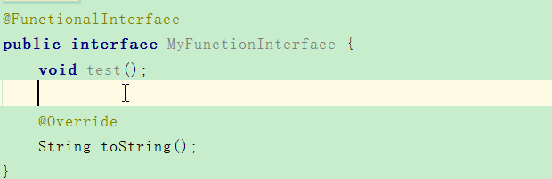
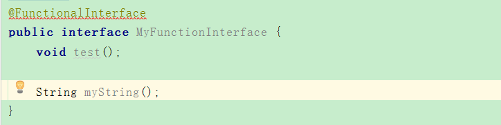

# lambda 表达式
## 何为lambda表达式
Lambda：In programming languages such as Lisp ，Python and Ruby lambda is a operator used to donote **anonymous functions or closures**,following the usage of lambda calculus.  
Lambda：在Lisp，Python和Ruby等编程语言中，lambda是一个用于表示匿名函数或闭包的运算符，下面是lambda演算的用法。

## 为何需要lambda表达式

在 java 中 ，我们无法将函数作为参数传递给一个方法，也无法声明返回一个函数的方法

>  **怎么理解**：函数在表示的是一个动作或者行为，如一个加法操作，在java8之前，我们只能将加法操作这个函数的返回值作为函数的参数，而不能将这个操作作为参数，而我们加法操作返回的结果也是加总后的值，在java8中，您将见到将这个加法操作函数作为参数进行传递，将一个函数作为返回值。

在javaScript中，函数参数是一个函数，返回值是另一个函数的情况是非常常见的，javaScript是一门非常典型的函数式语言

## lambda表达式基本结构

**(param1,param2,param3...)->{function body}**

有三部分组成，左边是参数列表，右边是方法体，中间以逗号分隔

## 接下来我们看一段代码

```
 public static void main(String[] args){
        List<Integer> integers = Arrays.asList(5, 7, 9, 10, 15, 18);
        for (int i=0,length=integers.size();i<length;i++){
            System.out.println(integers.get(i));
        }
        //---------------------------------- version 1.5
        for (Integer i:integers){
            System.out.println(i);
        }
        //---------------------------------- version 1.8
        integers.forEach(s->System.out.println(s));
    }
```

这是一段集合遍历的代码，可以看出就java version8的遍历非常简洁，`s->System.out.println(s)`这就是lambda表达式的基本语法应用  

我们对  `integers.forEach(s->System.out.println(s))`这句代码进行分析，其实这句话的代码是这样的:

```
//forEach代码实现
default void forEach(Consumer<? super T> action) {
        Objects.requireNonNull(action);
        for (T t : this) {
            action.accept(t);
        }
    }
```

```
integers.forEach(new Consumer<Integer>() {
            @Override
            public void accept(Integer integer) {
                System.out.println(s);
            }
        });
```

其实forEach方法接收的是一个Consumer 类型的参数,而Consumer 究竟是个什么东西，简单分析一下，后面会有详细讲解

```
package java.util.function;
import java.util.Objects;

@FunctionalInterface
public interface Consumer<T> {
    /**
     * Performs this operation on the given argument.
     * @param t the input argument
     */
    void accept(T t);
    
	default Consumer<T> andThen(Consumer<? super T> after){...} 
}
```

Consumer 是一个位于java.util.function 包下的一个接口，这个包是java version 8 新增加的一个包，且是一个@FunctionalInterface (函数式接口)，其中有一个void accept(T t)，这个方法是对给定的参数进行操作

## 何为函数式接口

这里简单的给大家分析一下，后面会有详细的介绍

```
**
 * An informative annotation type used to indicate that an interface
 * type declaration is intended to be a <i>functional interface</i> as
 * defined by the Java Language Specification.
 *
 * Conceptually, a functional interface has exactly one abstract
 * method.  Since {@linkplain java.lang.reflect.Method#isDefault()
 * default methods} have an implementation, they are not abstract.  If
 * an interface declares an abstract method overriding one of the
 * public methods of {@code java.lang.Object}, that also does
 * <em>not</em> count toward the interface's abstract method count
 * since any implementation of the interface will have an
 * implementation from {@code java.lang.Object} or elsewhere.
 *
 * <p>Note that instances of functional interfaces can be created with
 * lambda expressions, method references, or constructor references.
 *
 * <p>If a type is annotated with this annotation type, compilers are
 * required to generate an error message unless:
 *
 * <ul>
     * <li> The type is an interface type and not an annotation type, enum, or class.
 * <li> The annotated type satisfies the requirements of a functional interface.
 * </ul>
 *
 */
@Documented
@Retention(RetentionPolicy.RUNTIME)
@Target(ElementType.TYPE)
public @interface FunctionalInterface {}
```

@FunctionalInterface 这个注解时一个通知性的注解，旨在定义使用了该注解的接口是一个函数式接口，通过阅读@FunctionalInterface 的说明，可以得到以下几个信息.

- 从概念上来看，一个函数式接口中只能有唯一一个确定的抽象方法，当然，如果这个接口中重写了Object类中的抽象方法的话，它并不会给让接口中的抽象方法数量加一，即重新了Object类的抽象方法不会纳入函数式接口要求的统计中，这个接口还是一个函数式接口，原因是Object类是所有类的父类，接口的任何实现总会直接或间接的实现Object类的方法
  - 如图，toString()方法是Object类的方法，所以并不会出现编译错误
  - 
  - 如图，此时该接口中存在两个抽象方法，不满足函数式接口定义，编译不通过
  - 

- 使用了@FunctionalInterface 注解接口满足这两个要求，编译器就认为该接口是一个函数接口
  - 是一个接口，而不是注解，枚举或类
  - 满足上述函数式接口的要求(即只有唯一一个确定的抽象方法)

- 函数式接口的实例可以由lambda表达式，方法引用，构造方法引用来创建

- 编译器会认为只有只有唯一一个确定的抽象方法的接口为函数式接口，不管有没有加上@FunctionInterface注解

- 当我们给接口加上@FunctionInterface注解时，编译器编译时会对接口进行函数式接口的校验，所以，当你的接口是一个函数式接口时，尽量加上@FunctionInterface注解吧

## 函数式接口到底和lambda表达式有什么关系？

聪明的童鞋可能已经看出对于函数式接口的实现我们可以用lambda表达式来实现，lambda表达式可以理解为函数式接口的具体实现，当我们需要传递一个函数式接口作为参数时，你可以大胆的使用lambda表达式来进行替代.

## 函数式接口的类型推断

在lambda表达式中我们并没有指定参数的类型，而编译还能够通过，这是因为函数式接口中只有一个确定的抽象方法，那么JVM可以通过类型推断来判断参数的类型

end~~


