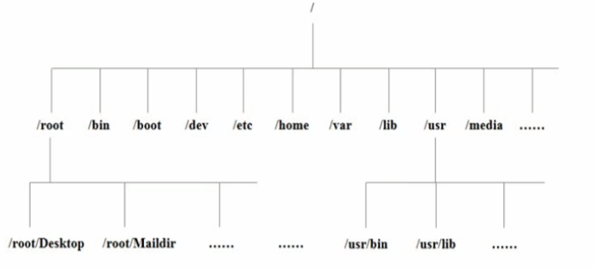

# linux介绍及环境搭建

## 学习方向
- linux 运维工程师
- linux 嵌入式工程师
- linux 开发项目
  - Java EE
  - 大数据
  - Python
  - PHP
  - c/c++

一般语言的桌面开发环境为Ubuntu  ，如python 

## linux 应用领域
- 个人桌面
- 服务器
- 嵌入式

## linux 学习流程
- 第一个阶段：linux环境下的基本操作命令，包括 文件操作命令(rm mkdir chmod chown)编辑器工具使用(vi vim) linux用户管理(user userdel usermod)等
- 第二个阶段：linux的各种配置(环境变量  网络配置  服务配置)
- 第三个阶段： linux下如何搭建对应语言的开发环境(大数据 Java EE Python等)
- 第四个阶段：能编写shell脚本对服务器进行维护
- 第五个阶段：能进行安全设置，防止攻击，保证服务器的正常运行，能对系统调优
- 第六各阶段：深入了解linux系统(对内核有研究)，熟练掌握大型网站应用架构组成，并熟悉各个环节的部署和维护方法

## Linux的学习方法
- 高效而愉快的学习
- 先建立一个整体的框架，然后细节
- 不需要掌握所有的Linux指令，要学会查询手册和百度
- 先know how ，在know why
- 计算机是一门“做中学“的学科，不是会了在做，而是做了才会
- 适当的囫囵吞枣
- linux不是编程，重点是实际操作，各种指令要玩的溜

## 环境准备
- VMware
- CentOS 系统
- CentOS下载地址
- 	网易镜像：http://mirrors.163.com/centos/6/isos/
- 	搜狐镜像：http:mirrors.sohu.com/centos/6/isos/
- 	vmtools 安装

## Linux 文件系统目录结构

linux的文件系统是采用层级的树状目录结构，在此结构中的最上层是根目录"/"，然后在此目录下在创建其他的目录

> 在linux世界里，一切皆文件

### 基本目录

- 具体的目录结构
  - /bin **[重点]** (/usr/bin、/usr/local/bin) 
    -	是Binary的缩写，这个目录存放者最经常使用的命令
  - sbin (/usr/bin、/usr/local/sbin)
    -	s 就是Super User的意思，这里存放的是系统管理员使用的系统管理程序
  - /home **[重点]**
    -	存放普通用户的主目录，在linux中每一个用户都有一个自己的目录，一般该目录名是以用户的账号命名的
  - /root **[重点]**
    -	该目录为系统管理员，也就是超级权限拥有者的用户主目录
  - /lib 
    -	系统开机所需要最基本的动态连接共享库，其作用类似于windows的dll文件，几乎所有的应用程序都需要用到这些共享库
  - lost+found
    -	这个目录一般情况下是空的，当系统非法关机后，这里就存放了一些文件
  - /etc **[重点]**
    -	所有的系统管理需要的配置文件和子目录
  - /usr **[重点]**
    -	这是一个非常重要的目录，用户很多的应用程序和文件都放在这个目录下，类似于Windows下的 program files 目录
  - /boot **[重点]**
    -	存放的是启动linux是使用的一些核心文件，包括一些连接文件以及镜像文件
  - /proc
    -	这个目录是一个虚拟的目录，它是系统内存的映射，访问这个目录来获取系统信息
  - /srv
    -	service 缩写，该目录存放一些服务启动之后需要提取的数据
  - /sys
    -	这是linux2.6内核的一个很大的变化，该目录下安装了2.6内核中新出现的一个文件系统sysfs
  - /tmp 	
    - 这个目录是用来存放一些临时的文件
  - /dev
    - 类似于Windows的设备管理器，把所有的硬件用文件的形式存储
  - /media **[重点]**
    - linux 系统会自动识别一些设备，列如 U盘、光驱等等，当识别后，linux 会把识别的设备挂载到这个目录下
  - /mnt **[重点]**
    - 系统提供该目录是为了让用户临时挂载别的文件系统的，我们可以将外部的存储挂载在/mnt/上，然后进入该目录就可以查看里面的内容
  - /opt 
    - 这是给主机额外安装软件所摆放的目录，如安装ORACLE数据库就可以放到该目录下，默认为空
  - /usr/local **[重点]**
    - 这是另一个给主机额外安装软件*所安装的目录*，一般通过编译源码方式安装的程序
  - /var  **[重点]**
    - 这个目录中存放着在不断扩充着的东西，习惯将经常被修改的目录放在这个目录下，包括各种日志文件
  - /selinux
    - selinux 是一种安全子系统，它能控制程序只能访问特性文件

## 远程操作登录软件
- xshell  远程登录软件
	- 如果连接不上，请查看linux是否开启sshd服务 ，端口默认22
	- reboot  # 重启linux服务器命令
	- 安装,傻瓜式next即可,安装目录最好是英文且无空格
- Xftp	远程文件上传下载
	- 是一款window平台的功能强大的SFTP,FTP文件传输软件，使用了xftp后,window用户能安全地在Unix/Linux和Windows PC之间传输文件。
	- 安装，同xshell
	- 连接时,选择协议端口和linux一致,FTP 协议端口21,SFTP端口22,协议选择SFTP
	- 界面中文乱码解决,设置编码格式为UTF-8,默认是GBK
	
	
## DB Study
- 	PostgreSQL  
- 	Maria DB