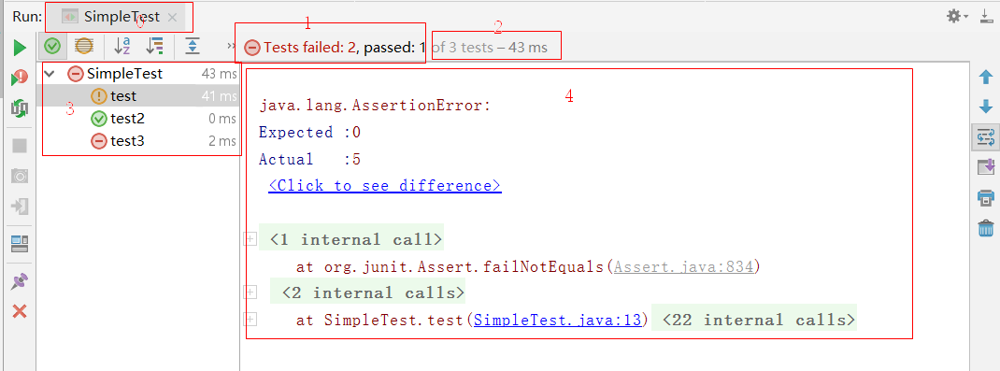
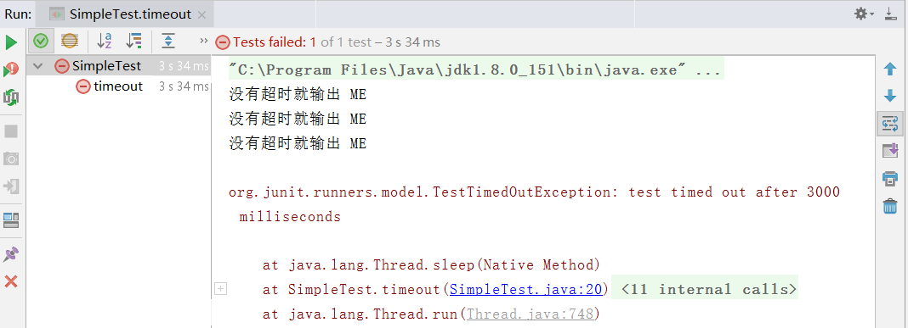
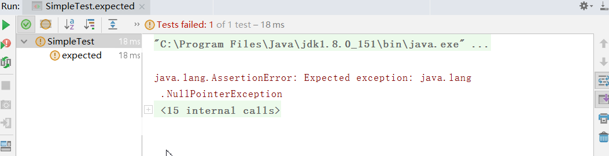

### JUnit 单元测试

> 最近公司推广自动化部署和持续集成，要求项目每个模块都必须进行单元测试，把这段时间的知识点记录一下~ 

环境：Intellij IDEA、JDK1.8、Maven、JUnit4.12


### 什么是软件测试
软件测试(英语：Software testing)，描述一一种用来促进鉴定软件的正确性，完整性、安全性和质量的过程。换句话说，软件测试是一种实际输出与预期输出之间的审核或者比较的过程。软件测试的经典定义是：在规定的条件下对程序进行操作，发现程序错误，衡量软件质量，并对其是否能满足设计要求进行评估的过程.

### 什么是集成测试
集成测试，也叫组合测试或联合测试。在单元测试的基础上，将所有模块按照需求设计要求(如根据结构图)组装成子系统或系统，进行集成测试.
原因：实践表明，一些模块虽然能够单独地工作，但并不能保证连接起来也能正常的工作。一些局部反映不出来的问题，在全局上很可能暴露出来

### 什么是单元测试
单元测试(Unit Testing)又称为模块测试，是针对程序模块(软件设计的最小单元)来进行正确性检验的测试工作.程序单元是应用的最小可测试部件.在面向过程的编程中，一个单元就是单个程序、函数、过程等；对于面向对象编程，最小单元就是方法，包括基类、抽象类，或者派生类中的方法.

### 单元测试的基本原则
宏观上,单元测试要符合AIR原则；微观上,单元测试的代码层面要符合BCDE原则。
AIR具体包括：A : Automatic （自动化） - I : Independent （独立性） - R : Repeatable （可重复）
BCDE原则： B: Border 边界值测试，包括循环边界、特殊取值、特殊时间点、数据顺序等。 - C: Correct 正确的输入,并得到预期的结果。 - D: Design 与设计文档相结合，来编写单元测试。 - E : Error 单元测试的目标是证明程序有错，而不是程序无错。为了发现代码中潜在的错误,我们需要在编写测试用例时有一些强制的错误输入（如非法数据、异常流程、非业务允许输入等）来得到预期的错误结果。

### 单元测试用例
单元测试用例是一部分代码，可以确保另一端代码(方法)按预期工作
单元测试用例的特点：已知输入和预期输出
每一项需求最少需要两个用例：一个正校验，一个负校验

### JUnit是什么东西
JUnit是Java编程语言中比较流行的一款单元测试框架，用于编写和可重复运行的自动化测试，能够满足平时开发中的大部分需求，且上手简单.
JUnit主要用于白盒测试和回归测试
- 白盒测试：把测试对象看做一个打开的盒子，程序的内部结构和其他信息对测试人员是公开的.
- 回归测试：软件或环境修复或更正后的在测试

### 为什么需要JUnit
JUnit促进了"先测试后编码"的理念，强调建立测试数据的一段代码，可以先测试，然后再应用，增加了程序员的产量和程序的稳定性，可以减少程序员压力和花费在排错的时间，从而提高开发的效率.

### JUnit有什么好处
提升开发质量
提升开发效率
提升重复测试率
增加重构自信

### JUnit 特点
- Junit是一个开源框架，用于编写和运行测试
- 提供注解来识别测试方法
- 提供断言来测试预期结果
- JUnit测试允许你编写代码更快，并提高代码质量
- Junit代码优雅简洁
- Junit测试可以自动运行并且检查自身结果并提供及时反馈，不需要人为梳理测试报告
- Junit测试可以被组织为测试套件，包含测试用例，甚至其他测试套件

### 依赖
- Maven
```
<dependency>
    <groupId>junit</groupId>
    <artifactId>junit</artifactId>
    <version>4.12</version>
    <scope>test</scope>
</dependency>
```

### 简单使用
```
public class SimpleTest {
    @Test
    public  void test(){
        int i=5;
        Assert.assertEquals(0,i);
    }
}
```
运行方式：右键->Run As->JUnit Test
测试报告：


- 0：测试类名称
- 1：测试未通过数量、测试通过数量
- 2：测试总数量
- 3：测试方法名称，注意颜色-> 绿色代表测试通过的，黄色感叹号代表测试失败的，红色减号代表测试过程中出现异常的
- 4：测试方法的跟踪信息，便于修正

### API
- Junit 注解

|    名称    | 作用 |
| ---------- | --- |
| @Test | 测试注解，标记一个方法可以作为一个测试用例 |
| @Before  | 标记该注解的方法在每个测试用例之前执行，以便于执行某些必要的先决条件 |
| @BeforeClass| 必须标记在静态方法之上，只执行一次并在类的所有测试之前，这种情况一般用于测试计算，共享配置(数据库连接等)|
| @After|标记该注解的方法在每个测试用例之后执行，一般做重置操作及删除临时变量 |
| @AfterClass| 必须标记在静态方法之上，只执行一次并在类的所有测试之后，一般用于释放资源，如数据库连接|
| @Ignore| 标记该注解的方法在测试时被忽略，不会执行 |
| @RunWith| 标识JUnit的运行环境 |
| @Parameters| 参数化测试，指定测试类的测试数据集合 |
| @SuiteClasses| 用于套件测试 |
| @Rule| 重新定义测试类方法的行为 |
| @FixMethodOrder | 指定测试方法的执行顺序 |
注意：

- 一个测试类单元测试的执行顺序为：@BeforeClass->@Before->@Test->@After->@AfterClass
- 一个测试方法的执行顺序为：@Before->@Test->@After

### 时间测试&&异常测试

时间测试&&异常测试属于@Test的两个属性

- expected：测试用例是否抛出指定的异常，如果没有抛出指定的异常JUnit将把它标记为失败
> source：
Class<? extends Throwable> expected() default None.class;

- timeout：当一个测试用例执行时间超过timeout指定的时间，那么JUnit将把它标记为失败
> source：
long timeout() default 0L;

- example
```
timeout：
@Test(timeout = 3000)
public void timeout() throws InterruptedException {
     while(true){
        System.out.println("没有超时就输出 ME");
        Thread.sleep(1000);
     }
}
```
测试报告：


```
expected：
@Test(expected = NullPointerException.class)
public  void expected(){
    int i=5;
    Assert.assertEquals(5,i);
}
```
测试报告：


### 参数化测试
JUnit4引入了一个新的功能参数化测试.参数化测试允许开发人员使用不同的值反复允许同一个测试。你将遵循5个步骤来创建参数化测试：
- 用@RunWith(Parameterized.class)来标记Test类
- 声明测试类变量，分别存储所用数据和期望值
- 创建一个公共的构造函数，它接受和一行和第二步相同的数据，为实例变量赋值
- 创建一个由@Parameter标记的public static method，它返回一个对象的集合(数组)来作为测试数据集合.
- 编写测试方法，用实例变量作为测试数据的来源进行测试

注意：按照实例化生命周期顺序应为：1->4->2->3->5

```
example：
/**
 * @Author: xbhel
 * @Date: 2019/11/16 13:24
 * @Description: 参数化测试
 */
public class ParameterCheckValue {
    /**
     * 业务方法 验证是否是素数
     * @param param
     * @return
     */
    public Boolean validate(int param){
        for(int i=2;i<(param>>1);i++){
            if(param%i==0){
                return false;
            }
        }
        return true;
    }
}

package com.xbhel.junit5before;

import org.junit.Assert;
import org.junit.Before;
import org.junit.Test;
import org.junit.runner.RunWith;
import org.junit.runners.Parameterized;

import java.util.Arrays;
import java.util.Collection;

/**
 * @Author: xbhel
 * @Date: 2019/11/16 13:28
 * @Description: JUnit 5 之前版本
 */
/**
 * 第一步 ：用@RunWith(Parameterized.class)来标记Test类
 */
@RunWith(Parameterized.class)
public class ParameterCheckValueTest {
    private  ParameterCheckValue parameterCheckValue;
    /**
     *第二步 ：声明测试类变量，分别存储所用数据和期望值
     */
    private int number;
    private boolean expectedResult;

    @Before
    public void setUp(){
        this.parameterCheckValue=new ParameterCheckValue();
    }

    /**
     * 第三步：创建一个公共的构造函数，它接受和一行和第二步相同的数据，为实例变量赋值
     * @param number
     * @param expectedResult
     */
    public ParameterCheckValueTest(int number,boolean expectedResult){
        this.number=number;
        this.expectedResult=expectedResult;
    }

    /**
     * 第四步：创建一个由@Parameter标记的public static method，它返回一个对象的集合(数组)来作为测试数据集合.
     * @return
     */
    @Parameterized.Parameters
    public static Collection paramPata(){
        return Arrays.asList(new Object[][]{
                {2,true},
                {9,false},
                {19,true},
                {21,false},
                {30,false}
        });
    }

    /**
     * 第五步：编写测试方法，用实例变量作为测试数据的来源进行测试
     */
    @Test
    public void test_validate(){
        Assert.assertEquals(expectedResult,parameterCheckValue.validate(number));
    }
}
```

###  @RunWith
首先要分清楚几个概念：测试方法、测试类、测试集、测试允许器
- 测试方法就是被@Test标注的方法
- 测试类是包含一个或多个测试方法的*Test.java文件
- 测试集就是一个suite，可以包含多个测试类
- 测试允许器则决定了用什么方式偏好去运行这些测试集/类/方法
@RunWith就是放在测试类名之前，决定这个类怎么运行，不标注时使用默认运行器，常见的运行器有：
- @RunWith(Parameterized.class)参数化运行器，配合@Parameters使用参数化测试功能
- @RunWith(Suite.class)、@SuiteClasses(ATest.class、BTest.class,...)测试集运行器  
- @RunWith(SpringRunner.class) Spring 运行器
还有许多的其他运行器，JUnit Runner 相当于提供一个标准，其他的环境想要运行必须提供相应的Runner

### 断言(Assert)

常用断言：

- assertEquals  检查两个变量或者等式是否平衡

- assertTrue 检查条件为真

- assertNotNull 检查对象不为空

- assertSame 检查两个相关对象是否指向同一对象

- assertArrayEquals 检查两个数组是否相等

  更多断言请查看Assert源码，见名知意(so easy)

### 一些小技巧   

- 命名：单元测试代码必须写在工程目录 src/test/java 下，且包名必须和业务代码名一致，类名为“业务类名称Test“，测试方法名称请采用驼峰命名法或其他类似的变体.
- Assert(断言)风格项目组最好一致
  - classic风格：即验证某项条件为真，在这个方法中需要验证执行方法的结果
  - matcher风格，通过语义化的代码来验证结果是否匹配，整个代码不需要太多的逻辑思考，更贴近我们的阅读习惯
```
example
@Test
    public  void get_result_when_vals_is_empty(){
        //模拟返回结果
        int result=0;
        //classic风格：即验证某项条件为真，在这个方法中需要验证执行方法的结果
        assertTrue(result==0);
        //matcher风格，通过语义化的代码来验证结果是否匹配
	    assertThat(result,equalTo(0));
    }
```
 在JUnit中，Assert提供了许多基础的断言API，通过`assertThat(T actual, Matcher<? super T> matcher)  `可以利用hamcrest开发的大量Matcher为我们的单元测试提供更好的语义支持

- 优化重构测试代码
  在编写单元测试时，**分支条件**和**边界条件**是需要重点关注的。这也会导致一个类的单元测试往往需要编写很多单元测试。因此有必要通过优化重构来保持代码的整洁和良好的可维护性和扩展性。

- 边界条件
  编写单元测试最主要、最直接的关注点就是方法执行的正确性。其次需要关注数据的*边界条件*，即在某些极端的或者不正确的条件下，程序能否正常的运行或者合理的运行，以此来保证系统的健壮性。常见的关注点有以下几个
  1. 不合实际的值（例：表示人类年龄的字段输入180或者负数）
  2. 不符合格式的值 （例：邮件，手机等）
  3. 算数溢出
  4. 空值，Null，空集合等
  5. 不合理的重复值
  6. 没有合理排序的值
  7. 事件发生的顺序异常（例: 在创建用户之前就进行信息编辑等）

注意：JUnit中每个单元测试都拥有独立的上下文环境，执行每个测试方法都会生成一个新的实例，因此如法保证单元测试用例的执行顺序.可以通过@FixMethodOrder指定


参考博文：
- https://zhuanlan.zhihu.com/p/55648107   (*)
- https://juejin.im/post/59fb268a518825296421085d
- https://juejin.im/post/5c6ac82ee51d451b240a878a
- https://juejin.im/post/5bdfcc2fe51d451ae86cd2c4

