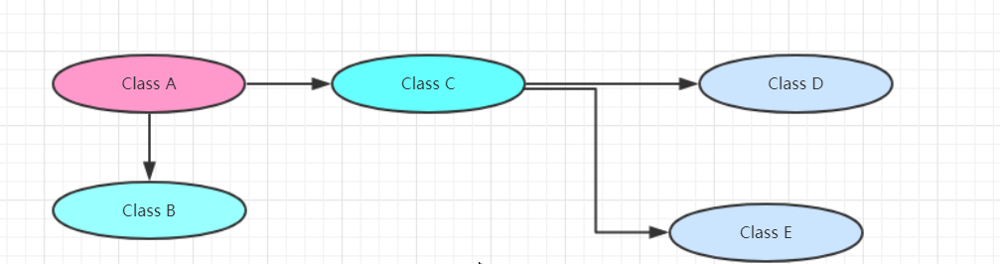
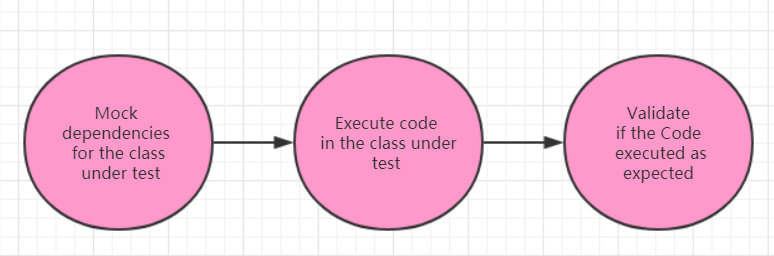

### Mock测试

mockito官网：http://mockito.org
API文档：http://docs.mockito.googlecode.com/hg/org/mockito/Mockito.html
项目源码：https://github.com/mockito/mock

### 什么是Mock
Mock的中文译为仿造的、模拟的、虚假的，对测试框架而言就是构造一个模拟/虚假的对象(替身,Mock对象)，使测试能顺利进行下去.

### 为什么需要
对单元测试的补充；单元测试的思路是在不涉及依赖关系的情况下测试代码(隔离性),所以测试代码与其他类或者系统的关系应该尽量被消除。一个可行的消除方法是替换掉依赖类(测试替换)，也就是说我们可以使用替身(mock)来替换掉真正的依赖对象.如：

为了测试Class A，需要隔离Class B、Class C，因此需要Mock B和C，如下：

由图可知：
- mock对象就是在调试期间用来作为真实对象的替代品
- mock测试可以在测试过程中，对那些不易构建的对象用一个虚拟对象来代替测试的方法

### 有什么好处
- 提前创建测试，TDD(测试驱动开发)
	这是个最大的好处吧。如果你创建了一个Mock那么你就可以在service接口创建之前写Service Tests了，这样你就能在开发过程中把测试添加到你的自动化测试环境中了。换句话说，模拟使你能够使用测试驱动开发.
- 可以很简单的虚拟出一个复杂对象(如虚拟出一个接口的实现类)
- 可以配置mock对象的行为
- 可以使测试用例只注重测试流程与结果
- 减少外部类、系统和依赖给单元测试带来的耦合
- 团队可以并行工作
- 为无法访问的资源编写测试

### 测试类的分类
- dummy object(虚拟对象)作为参数传递给方法但是绝对不会被使用。譬如说，这种测试类内部的方法不会被调用，或者是用来填充某个方法的参数.
- Fake(伪造对象)是真正接口或抽象类的实现体，但给对象内部实现很简单。譬如说，它存在内存中而不是真正的数据库中。（译者注：Fake 实现了真正的逻辑，但它的存在只是为了测试，而不适合于用在产品中） 
- stud(存根类)依赖类的部分方法实现，而这些方法在你测试类和接口的时候会被用到，也就是说 stub 类在测试中会被实例化。stub 类会回应任何外部测试的调用。stub 类有时候还会记录调用的一些信息
- mock object 是指类或者接口的模拟实现，你可以自定义这个对象中某个方法的输出结果

> 测试替代技术能够在测试中模拟测试类以外对象。因此你可以验证测试类是否响应正常。譬如说，你可以验证在 Mock 对象的某一个方法是否被调用。这可以确保隔离了外部依赖的干扰只测试测试类。
我们选择 Mock 对象的原因是因为 Mock 对象只需要少量代码的配置。

### Mock对象的生成
你可以手动创建模拟对象(通过代码)，或是使用mock框架来模拟这些类，mock框架运行你在执行其创建模拟对象，并且定义它们的行为.
数据源(data peovider)就是一个典型的模拟对象的例子，在运行中，它会使用一个实现来连接真正的数据源。但是在测试期间，模拟对象会对数据源进行模拟，并且确保这个测试条件一直保持统一.
这些模拟对象可以提供给正在被测试的类。因此，被测试的类应该避免任何对外部数据的强依赖
模拟或模拟框架允许测试使用模拟对象对期待中的反应进行测试，例如，你可以确认模拟对象中只有特定的方法被调用.

### 什么是Mockito
了解什么是mock测试及一些重要理论后，我们来看一下Mockito~
Mockito是一个流行的mock框架，可以和JUnit一起结合使用，Mockito允许你创建模拟对象，并且对其进行配置。使用Mockito在对类进行测试的时候可以极大的简化外部依赖.
一般使用Mockito需要执行下面三步：

-  模拟并替换测试代码中外部依赖
-  执行测试代码
-  验证测试代码是否被正确的执行  



### 添加Mockito依赖
- Gradle
> repositories { jcenter() }
dependencies { testCompile "org.mockito:mockito-core:2.0.57-beta" }     

- Maven
><dependency> 
<groupId>org.mockito</groupId> 
<artifactId>mockito-core</artifactId> 
<version>3.1.0</version> 
<scope>test</scope> 
</dependency>  

### 静态导入
补充一个小知识点~，以前没太注意，如果你使用静态导入，可以直接使用静态方法，不需要通过”ClassName.methodName“的形式,使用方式如：import static org.mockito.Mockito.*;

### 简单使用
```

```

### Mockito API
mock()