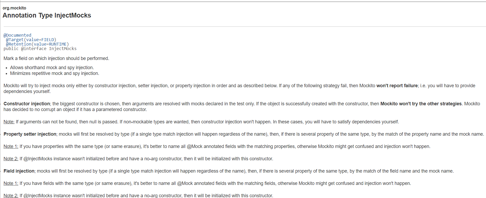

###  深入了解Mockito

#### @InjectMock了解吗 ?

官网介绍地址：https://javadoc.io/doc/org.mockito/mockito-core/latest/org/mockito/InjectMocks.html

先上一段官网介绍：


大概就是说：被@InjectMock标记的字段对应的类，Mockito将自动去注入(Mock)该类中的字段，前提是这些字段是已经通过@Mock或者@Spy创建；Mockito将按顺序通过constructor injection, setter injection, or property injection 来注入mock,如果constructor injection注入成功，将不会在调用 setter 和property injection注入~

- constructor injection

选择最大的构造函数，仅仅在测试中使用mock来解析参数，如果constructor injection注入成功，则不会执行setter injection, or property injection ,如果参数没有找到则设置为null，如果没有对应的Mock类型，则不会发送注入.

```
public class ArticleCalculator {
}

public class ArticleDatabase {
}

@Getter
public class ArticleManager {
    private ArticleCalculator  calculator;
    private ArticleDatabase database;
	
	//Constructor injection
    public ArticleManager(ArticleCalculator calculator, ArticleDatabase database) {
        this.calculator=calculator;
        this.database=database;
    }
}

public class BasicTest {
    @Before
    public void setUp(){
        MockitoAnnotations.initMocks(this);
    }
}

public class ArticleManagerTest extends BasicTest{
    @Mock private ArticleCalculator articleCalculator;
    @Mock private ArticleDatabase articleDatabase;
    @InjectMocks private ArticleManager manager;

    @Test
    public  void test_how_to_use_injectMock(){
        System.out.println(manager.getCalculator().getClass());
        System.out.println(manager.getDatabase().getClass());
    }
}

```

如上代码所示，`ArticleManager `中有一个`ArticleManager(ArticleCalculator calculator, ArticleDatabase database)`构造，测试类`@InjectMocks` 标记了`ArticleManager manager`，且测试类中通过`@Mock`创建了`ArticleCalculator articleCalculator`、`ArticleDatabase articleDatabase`；此时Mockito将自动将`articleCalculator、articleDatabase`注入到`ArticleManager `中

- setter injection

通过setter方法注入，如果有多个相同类型的属性需要注入，请指定他们的名称，否则Mockito将分不清注入哪个从而也不会发生注入,如果setter injection注入成功,将不会再调用 property injection 注入~

```
 @Getter
public class ArticleManager {
    private ArticleCalculator  calculator;
    private ArticleDatabase database;	
 	//Property setter injection
    public void setCalculator(ArticleCalculator calculator) {
        this.calculator = calculator;
    }  
    public void setDatabase(ArticleDatabase database) {
        this.database = database;
    }
}

public class ArticleManagerTest extends BasicTest{
    @Mock private ArticleCalculator articleCalculator;
    //指定对应要注入字段的名称，使用@Mock(name="filedName")
    @Mock(name="database") private ArticleDatabase articleDatabase;
    @InjectMocks private ArticleManager manager;
}

```

与constructor injection不同的就是setter injection是通过setter方法注入的~

- property injection 

通过字段进行注入，如果有多个相同类型的属性需要注入，请指定他们的名称，否则Mockito将分不清注入哪个从而也不会发生注入

```
 @Getter
public class ArticleManager {
	//property injection
    private ArticleCalculator  calculator;
    private ArticleDatabase database;	
}
```

与constructor injection不同的就是property injection是通过字段注入的~


#### ArgumentMatchers 了解吗 ?
相关博文：
- https://www.baeldung.com/mockito-argument-matchers
- https://javadoc.io/static/org.mockito/mockito-core/3.1.0/org/mockito/ArgumentMatchers.html

Mockito提供了各种配置mock方法的方式，其中之一就是返回固定值：

```
doReturn("Flower").when(flowerService).analyze("poppy");
```

在上面的例子中，字符串“Flower”仅仅在analyze 方法接收参数为 "poppy"时才被返回.

**有时候我们可能需要对更大范围(wildcard)的值或事先未知的值做出响应**，在这些场景中，**我们可以使用argument matchers 来配置 mock method.**

```
when(flowerService.analyze(anyString())).thenReturn("Flower");
```

因为使用了`anyString` argument matcher, 所以不管我们传递什么只给analyze返回的结果都是一样的.*ArgumentMatchers* 允许我们使用灵活的verification or stubbing.

如果方法有多个的参数，**仅仅使用ArgumentMatchers去处理某些参数是不被允许的**，换而言之，Mockito要求你对每个参数都使用argument matcher或者都使用确定的值.

下面就是一个错误的例子：

```
abstract class FlowerService {
    public abstract boolean isABigFlower(String name, int petals);
} 

FlowerService mock = mock(FlowerService.class);

when(mock.isABigFlower("poppy", anyInt())).thenReturn(true)
```

为了修正它，并且保持使用“poppy”，我们将使用eq matcher：

```
when(flowerService.isABigFlower(eq("poppy"),anyInt())).thenReturn(true);
```

有两点需要注意的是：

- 我们不能使用他们作为返回值，当stubbing calls 需要返回一个精确地值
- 我们不能再verification or stubbing 之外使用 argument matchers

最后一种情况,Mockito将检查不合时宜的参数并且抛出 *InvalidUseOfMatchersException*.

一个错误的例子：

```
//You cannot use argument matchers outside of verification or stubbing.
String orMatcher = or(eq("poppy"), endsWith("y"));

verify(mock).analyze(orMatcher);
```

正确的方式：

```
verify(mock).analyze(or(eq("poppy"), endsWith("y")));
```


#### Hamcrest 还不会吗 ?