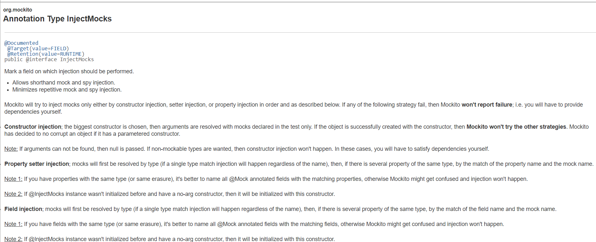
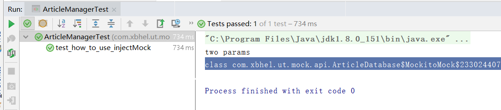

###  深入了解Mockito

#### @InjectMock是啥~
先上一段官网介绍：


大概就是说：被@InjectMock标记的字段对应的类，Mockito将自动去注入该类中的字段，前提是这些字段是已经通过@Mock或者@Spy创建；Mockito将按顺序通过constructor injection, setter injection, or property injection 来注入mock

- constructor injection

选择最大的构造函数，仅仅在测试中使用mock来解析参数，如果constructor injection注入成功，则不会执行setter injection, or property injection ,如果参数没有找到则设置为null，如果没有对应的Mock类型，则不会发送注入.

- setter injection

通过setter方法注入，如果有多个相同类型的属性需要注入，请指定他们的名称，否则Mockito将分不清注入哪个从而也不会发生注入

- property injection 

通过字段进行注入，如果有多个相同类型的属性需要注入，请指定他们的名称，否则Mockito将分不清注入哪个从而也不会发生注入

可能代码更加直观一点：

```
@Getter
public class ArticleManager {
    /**
     * field setter
     */
    private ArticleCalculator  calculator;
    private ArticleDatabase database;

    /**
     * Constructor injection 构造注入会使用该构造
     * @param calculator
     * @param database
     */
    public ArticleManager(ArticleCalculator calculator, ArticleDatabase database) {
        this.calculator=calculator;
        this.database=database;
        // parameterized constructor
        System.out.println("two params");
    }

    public ArticleManager(ArticleCalculator calculator) {
        this.calculator = calculator;
        System.out.println("one params");
    }

    /**
     * Property setter
     * @param calculator
     */
    public void setCalculator(ArticleCalculator calculator) {
        this.calculator = calculator;
    }

    /**
     * Property setter
     * @param database
     */
    public void setDatabase(ArticleDatabase database) {
        this.database = database;
    }
}

public class ArticleCalculator {
}

public class ArticleDatabase {
}

public class BasicTest {
    @Before
    public void setUp(){
        MockitoAnnotations.initMocks(this);
    }
}

public class ArticleManagerTest extends BasicTest{
    //@Mock private ArticleCalculator articleCalculator;
    //@Mock(name = "database")  指定名称
    @Mock(name = "database") private ArticleDatabase articleDatabase;
    @InjectMocks private ArticleManager manager;

    @Test
    public  void test_how_to_use_injectMock(){
        // System.out.println(manager.getCalculator().getClass());
        System.out.println(manager.getDatabase().getClass());
    }
}

```



